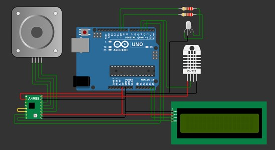

# Control de Temperatura con Arduino y Motor Paso a Paso

## Descripción del sistema

Este proyecto implementa un sistema de control de temperatura basado en Arduino, que regula una válvula rotatoria mediante un motor paso a paso controlado por un driver A4988. La válvula modula el flujo de fluido caliente o frío para mantener la temperatura interna en un rango deseado.

Se integra un sensor DHT22 para medir temperatura y humedad, un LCD I2C para mostrar datos en tiempo real, y un LED RGB para indicaciones visuales de estado del sistema. El control implementado es un algoritmo discontinuo con zona muerta (control de tres posiciones) y actuación proporcional basada en la diferencia entre la temperatura medida y la temperatura objetivo.

---

## Estructura del hardware

| Componente         | Descripción                                       | Conexiones Arduino                      |
|--------------------|-------------------------------------------------|---------------------------------------|
| Arduino Uno        | Microcontrolador principal                        | Fuente de alimentación y pines digitales|
| DHT22              | Sensor de temperatura y humedad                   | Pin digital (por ejemplo, pin 2)       |
| LCD 16x2 con I2C   | Display para visualización de datos                | Pines SDA (A4) y SCL (A5)               |
| Driver A4988       | Controlador de motor paso a paso                   | Pins STEP (3), DIR (4), MS1-MS3 (configurados a 5V), VMOT y GND  |
| Motor paso a paso  | Actuador que regula la válvula                      | Conectado al driver A4988               |
| LED RGB            | Indicador visual de estados del sistema            | Pines PWM con resistencias en R y B, común a GND |

---

## Algoritmo de control

### Objetivo

Mantener la temperatura interna en un valor deseado (setpoint) mediante la regulación del flujo de fluido caliente o frío, que se controla físicamente con la apertura de una válvula motorizada.

### Funcionamiento básico

1. **Medición**: El sensor DHT22 proporciona la temperatura ambiente interna en grados Celsius.
2. **Comparación**: Se calcula la diferencia `error = temperatura_deseada - temperatura_actual`.
3. **Zona muerta (histeresis)**: Se define un rango o banda muerta alrededor de la temperatura deseada para evitar oscilaciones frecuentes de la válvula y desgaste del motor. Si el error está dentro de esta banda, no se actúa sobre la válvula.
4. **Acción de control discontinuo**:
   - Si `error` es mayor que el umbral positivo, se abre la válvula para permitir paso de fluido caliente.
   - Si `error` es menor que el umbral negativo, se abre la válvula para permitir paso de fluido frío.
   - Si `error` está dentro de la banda muerta, la válvula se mantiene fija.
5. **Actuación proporcional**:
   - La apertura de la válvula se modula proporcionalmente a la magnitud del error (diferencia de temperatura).
   - El número de pasos que se manda al motor paso a paso es proporcional a `|error|`, controlando así la apertura de la válvula.
   - El sentido de giro del motor define si se abre la válvula para calor (giro horario) o para frío (giro antihorario).
6. **Actualización continua**: El sistema lee continuamente la temperatura y ajusta la válvula según el algoritmo para mantener la temperatura estable.

### Ventajas del control discontinuo con zona muerta

- Evita que el motor paso a paso esté continuamente actuando cuando la temperatura está muy cercana al setpoint.
- Reduce el desgaste mecánico de la válvula y el consumo energético.
- Proporciona un control sencillo, efectivo para sistemas con respuesta lenta como regulación térmica.

---

## Descripción detallada del código

- **Lectura de sensores**: Se usa la librería DHT para obtener temperatura y humedad en intervalos regulares.
- **Control del motor paso a paso**:
  - Se configura el driver A4988 con microstepping (MS1, MS2, MS3 a 5V para paso completo).
  - Se definen dos pines digitales para STEP (pasos) y DIR (dirección).
  - Según el error calculado, se envía un número proporcional de pulsos STEP con la dirección adecuada.
- **Visualización en LCD I2C**:
  - Se muestra la temperatura actual, la temperatura deseada y el estado de la válvula (cerrada, abierta hacia calor o abierta hacia frío).
- **LED RGB**:
  - Cambia de color según el estado del sistema: por ejemplo, roja si la válvula de calor está abierta, azul si está abierta la de refrigeración.

---

## Diagrama de bloques del sistema

---

## Conexiones clave del circuito

- **DHT22**: Pin DATA conectado al pin digital 2 del Arduino, alimentación 5V y GND.
- **LCD I2C**: SDA a A4, SCL a A5, alimentación 5V y GND.
- **Driver A4988**:
  - VMOT a 5V externo o regulado, GND común.
  - STEP a pin 3 Arduino.
  - DIR a pin 4 Arduino.
  - MS1, MS2, MS3 a 5V para paso completo.
  - RESET y SLEEP conectados juntos a 5V para habilitar.
- **Motor paso a paso**: conectados a salidas A+/A-, B+/B- del driver A4988.
- **LED RGB**: resistencias de 220 Ω en los pines R y B, comunes a GND, conectados a pines 9 y 10 del Arduino (según código).

---

